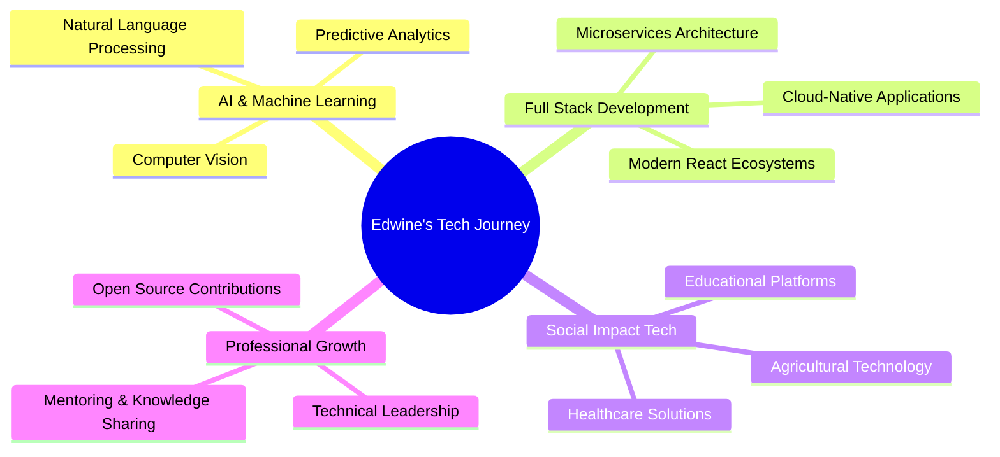

**💻 Full Stack Developer | 🚀 Tech Innovator | 🌍 Problem Solver**

*Crafting digital solutions that bridge technology and real-world impact*

---

## 🎯 About Me

> *"Code with impact, build for the future."*

🌍 **Based in Nairobi, Kenya** - Bringing global standards to local solutions  
🔭 **Currently Building**: AI-powered applications, scalable booking systems, and cutting-edge portfolio projects  
🌱 **Learning Journey**: Mastering Cloud & DevOps (AWS, Docker, Kubernetes) to scale applications globally  
👯 **Open to Collaborate**: On open-source projects, innovative startups, and tech-for-good initiatives  
⚡ **Mission**: Leveraging technology to create meaningful impact in **agriculture**, **healthcare**, and **education**

---

## 🛠️ Tech Arsenal

<b>🎨 Frontend Technologies</b>

 

| Technology | Proficiency | Use Cases |
|------------|-------------|-----------|
|  | ⭐⭐⭐⭐⭐ | Interactive UIs, SPAs |
|  | ⭐⭐⭐⭐⭐ | Full-stack React apps |
|  | ⭐⭐⭐⭐⭐ | Type-safe development |
|  | ⭐⭐⭐⭐ | Enterprise applications |
|  | ⭐⭐⭐⭐⭐ | Rapid UI development |

<b>⚙️ Backend Technologies</b>

 

| Technology | Proficiency | Use Cases |
|------------|-------------|-----------|
|  | ⭐⭐⭐⭐⭐ | REST APIs, Real-time apps |
|  | ⭐⭐⭐⭐⭐ | Web applications, APIs |
|  | ⭐⭐⭐⭐ | Enterprise Java apps |
|  | ⭐⭐⭐⭐⭐ | Web servers, APIs |
|  | ⭐⭐⭐⭐⭐ | AI/ML, Data processing |

<b>🗄️ Database & Cloud</b>

 

| Technology | Proficiency | Use Cases |
|------------|-------------|-----------|
|  | ⭐⭐⭐⭐⭐ | Document databases |
|  | ⭐⭐⭐⭐ | Relational databases |
|  | ⭐⭐⭐⭐ | Web applications |
|  | ⭐⭐⭐⭐ | Real-time databases |
|  | ⭐⭐⭐ | Cloud deployment |

<b>🔧 Development Tools</b>

 

---

## 🚀 Featured Projects

### 🌟 **Spotlight Projects**

<table>
<tr>
<td width="50%">

**🛍️ Jikoni Market Kenya**
- **Tech Stack**: TypeScript, React, Node.js
- **Description**: Full-featured online marketplace for Kenyan food products
- **Features**: Payment integration, vendor management, real-time inventory
- **Status**: 🚧 In Active Development

</td>
<td width="50%">

**👩‍⚕️ Flomentor Health App**
- **Tech Stack**: React Native, Firebase
- **Description**: Menstrual health advisory & tracking system
- **Features**: Period tracking, health insights, community support
- **Impact**: 📈 Improving women's health awareness

</td>
</tr>
<tr>
<td width="50%">

**🌱 AI Irrigation System**
- **Tech Stack**: JavaScript, IoT, Machine Learning
- **Description**: Smart irrigation using AI & IoT sensors
- **Features**: Weather prediction, soil moisture analysis
- **Impact**: 🌾 Sustainable agriculture solutions

</td>
<td width="50%">

**🏠 Hostels Booking System**
- **Tech Stack**: Full-stack web application
- **Description**: Complete room reservation & payment system
- **Features**: M-Pesa integration, real-time availability
- **Status**: ✅ Production Ready

</td>
</tr>
</table>

### 🔬 **Technical Showcases**

| Project | Language | Description | Status |
|---------|----------|-------------|---------|
| **🏦 Bank Simulation** |  | Core banking functions simulation | ✅ Complete |
| **📖 Library Management** |  | Digital library with advanced search | ✅ Complete |
| **👁️ Computer Vision Attendance** |  | AI-powered attendance tracking | 🚧 Beta |
| **💊 Diabetes Prediction** |  | ML-based health prediction system | ✅ Complete |

---

## 📊 GitHub Analytics

### 📈 **Contribution Insights**

---

## 🏆 Achievements & Milestones

| 🎯 **Goals** | 📊 **Status** | 🎉 **Milestone** |
|--------------|---------------|-------------------|
| **Open Source Contributions** |  | 10+ repositories |
| **Projects Completed** |  | 25+ projects |
| **Technologies Mastered** |  | 15+ tech stack |
| **Community Impact** |  | 5+ social impact projects |

## 🎯 Current Focus Areas

---

## 🌐 Let's Connect & Collaborate

### 📬 **Get In Touch**

### 🤝 **Open to Opportunities**

- 💼 **Full-time positions** in innovative tech companies
- 🚀 **Freelance projects** requiring full-stack expertise
- 🌍 **Open-source collaborations** with social impact
- 🎯 **Mentorship opportunities** in tech education

---

## 🐍 Contribution Snake

---

### 💭 **Philosophy**

*"Technology is not just about code—it's about creating bridges between what is and what could be. Every line of code is an opportunity to make someone's life better."*

**⭐ Star my repositories if you find them interesting!**

---

